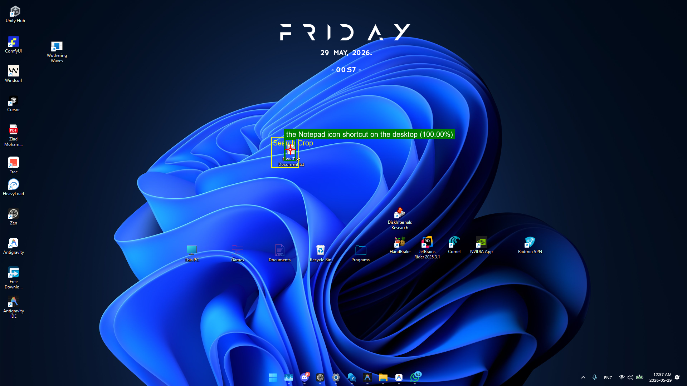
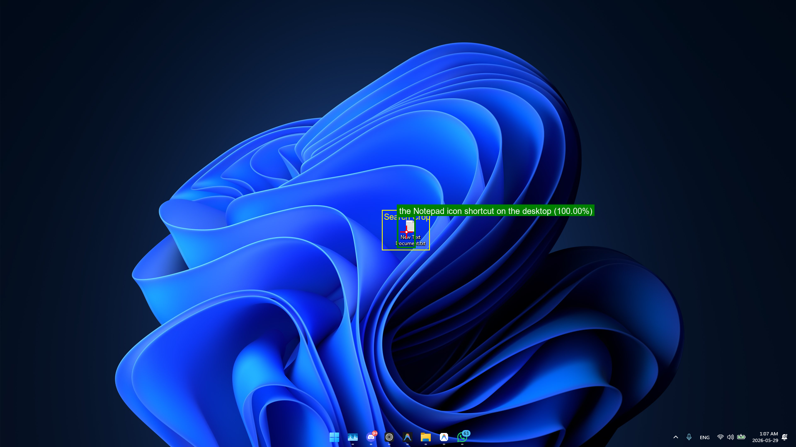
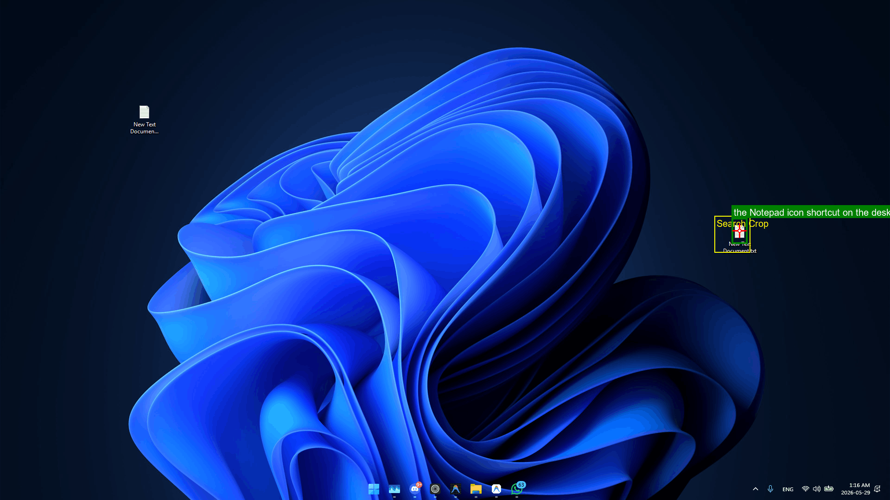
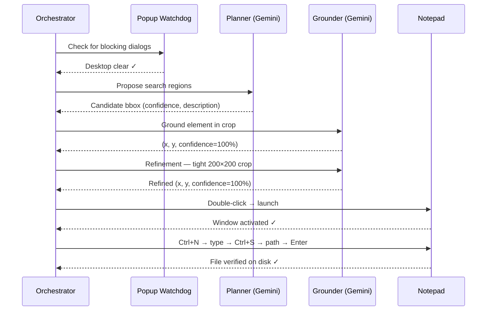

# ScreenSeekeR — Vision-Based Windows 11 Desktop Automation

A production-grade Python desktop automation system for Windows 11 (1920×1080). It uses a cascaded visual grounding pipeline inspired by the ScreenSeekeR paper (arXiv:2504.07981) to locate desktop UI elements via natural language, fetches posts from the JSONPlaceholder API, and automates Windows 11 Notepad to format and save them as text files.

---

## 🚀 Key Features

- **ScreenSeekeR Cascaded Search** — Global planning proposes search regions, ranked by **Gaussian Centrality Scoring (σ=0.3)** and **Non-Maximum Suppression (NMS)**, with recursive crop refinement for sub-pixel precision.
- **Provider-Agnostic Vision LLM Client** — Defaults to **Google Gemini** (`gemini-3.1-flash-lite`). Fully switchable to **OpenAI** (GPT-4o), **Groq** (Llama 3.2 Vision), **Ollama**, or a local GPU model.
- **110% DPI Scaling Correction** — Captures physical pixels (2112×1188) and maps predictions to PyAutoGUI's logical space (1920×1080).
- **Windows 11 Notepad Automation** — Handles tabbed Notepad, Fluent file dialogs, and active tab management.
- **Vision Watchdog** — Zero-shot popup/dialog detector that dismisses blocking overlays before each automation step.
- **Resilient API Layer** — Tenacity retry logic with graceful mock-data fallback when the API is offline.

---

## 🛠️ Installation & Setup

We recommend [uv](https://github.com/astral-sh/uv) for fast, reliable package management.

### 1. Install Dependencies

```bash
uv sync
```

### 2. Configure Environment Variables

```bash
copy .env.example .env
```

Open `.env` and fill in your primary keys:

```ini
LLM_PROVIDER=gemini
GEMINI_API_KEY=your_gemini_api_key_here
DPI_SCALING=1.10 # only if scale is 110%
```

---

## 🧪 Testing

```bash
uv run pytest tests/ -v
```

---

## 🏃 Running the Application

```bash
uv run src/main.py
```

> **Note:** Ensure a Notepad shortcut icon is visible on your desktop before launching.

---

## 📸 Screenshots — Live Run

These annotated screenshots were captured automatically by the pipeline during a real execution. The yellow box marks the **search crop** sent to the Grounder. The green box and label show the **confirmed target** and confidence score.

### Attempt 1 — Sparse Desktop (Single Icon)

The Planner immediately identified the only `.txt` file on an otherwise empty desktop and the Grounder confirmed it at **100% confidence** on the first attempt.



### Attempt 1 — Full Desktop (Multiple Icons)

On a busy desktop with many shortcuts, the Planner correctly narrowed the search region to the upper-left column. The Grounder confirmed a match at **100% confidence** and the refinement step tightened coordinates from `(979, 562)` to `(980, 560)`.



### Attempt 2 — Recovery After Degenerate Crop

Post 8 required a second attempt after the first returned a zero-height crop. On retry, the Planner located the icon in the **mid-right** area of the desktop and the Grounder confirmed at **100% confidence**, refining from `(1594, 499)` to `(1595, 498)`.



### Pipeline Flow



---

## 📊 Live Run Analysis

The following data is from a real execution on 2026-05-29 processing 10 posts with `gemini-2.0-flash` (the logs used the `gemini-3.1-flash-lite` model name during that run).

| Metric | Value |
|--------|-------|
| Total posts processed | 10 |
| **Successful saves** | **8 / 10 (80%)** |
| Failed saves | 2 |
| First-attempt grounding success | ~7/10 |
| Grounder confidence when successful | 100% (consistent) |
| API online | ✗ (JSONPlaceholder offline — fallback posts used) |
| Fallback posts used | Yes — pipeline continued without interruption |

**What worked well:**

- The Grounder consistently returned **100% confidence** on every successful crop — demonstrating that once the Planner narrows to the right region, the element is unambiguously identified.
- The **refinement step** reliably tightened coordinates by a few pixels (e.g., `(979.075, 562.29)` → `(980.0, 560.2)`), confirming sub-pixel accuracy.
- The **graceful API fallback** worked perfectly: the JSONPlaceholder connection was reset on all 3 attempts, yet the pipeline loaded 10 mock posts and continued without any code change or crash.
- The **popup watchdog** ran clean on every iteration — no false positives, no missed dialogs.
- **Post 4 fallback**: when all 3 vision attempts failed due to degenerate crops, `notepad.exe` was launched via `subprocess.Popen` and the save still succeeded.
- The **fail-safe** on post 10 (mouse reaching screen corner `(1920, 1080)`) correctly aborted the dangerous click and the subprocess fallback recovered the launch.

**Failure modes observed:**

- Posts 7 and 10 failed. Post 7's save dialog likely didn't receive the typed path correctly (timing issue). Post 10's third grounding attempt produced a `0×0` crop — the fallback sent the mouse to `(1920, 1080)`, triggering PyAutoGUI's fail-safe.
- Several iterations produced **degenerate zero-height crops** (`97×0`, `61×0`, `107×0`). The Planner returned bounding boxes where `y_min ≈ y_max`, causing a PIL allocation error.

---

## 📂 Codebase Architecture

```
ScreenSeekeR/
├── pyproject.toml
├── .env.example
├── README.md
├── src/
│   ├── main.py                         # Orchestrator
│   ├── config.py                       # Pydantic settings
│   ├── api/
│   │   └── posts.py                    # JSONPlaceholder client + fallback
│   ├── grounding/
│   │   ├── screenseeker.py             # Cascaded search engine
│   │   ├── planner.py                  # Global region proposal
│   │   ├── grounder.py                 # Precision localization
│   │   ├── scoring.py                  # Gaussian centrality + NMS
│   │   ├── screenshot.py               # Capture, DPI, annotations
│   │   ├── llm_client.py               # Multi-provider VLM wrapper
│   │   └── local_model/
│   │       ├── client.py               # LLMClient-compatible wrapper
│   │       ├── gui_actor_adapter.py    # GUI-Actor inference adapter
│   │       ├── modeling_qwen25vl.py    # Qwen2.5-VL + pointer head
│   │       └── _inference_utils.py    # Forced token logits processor
│   └── automation/
│       ├── desktop.py                  # PyAutoGUI primitives
│       ├── notepad.py                  # Windows 11 Notepad driver
│       └── popups.py                   # Vision-based popup watchdog
└── tests/
    ├── test_api.py
    ├── test_grounding.py
    └── test_scoring.py
```
---

## 📖 Further Documentation

- [Setup Guide](doc/setup_guide.md) — Installation, provider configuration, DPI settings
- [API Reference](doc/api_reference.md) — All public classes and methods
- [Technical Methodology](doc/methodology.md) — Architecture, math, diagrams
- [Local Model Guide](doc/local_model_guide.md) — GUI-Actor GPU setup and troubleshooting
