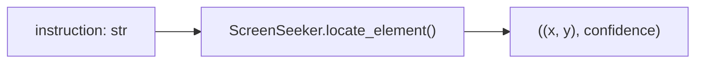

# API Reference

Complete reference for all public classes, methods, and functions in the ScreenSeekeR codebase.

---

## Table of Contents

1. [Grounding Engine](#grounding-engine)
   - [ScreenSeeker](#screenseeker)
   - [Planner](#planner)
   - [Grounder](#grounder)
   - [Scoring Functions](#scoring-functions)
   - [Screenshot Utilities](#screenshot-utilities)
   - [LLMClient](#llmclient)
2. [Local Model](#local-model)
   - [LocalModelClient](#localmodelclient)
   - [GUIActorAdapter](#guiactoradapter)
3. [Automation](#automation)
   - [NotepadWorkflow](#notepadworkflow)
   - [PopupHandler](#popuphandler)
   - [Desktop Actions](#desktop-actions)
4. [API Layer](#api-layer)
   - [PostClient](#postclient)
   - [Post](#post)
5. [Utilities](#utilities)
   - [robust_retry](#robust_retry)
6. [Configuration](#configuration)
   - [Settings](#settings)

---

## Grounding Engine

### ScreenSeeker

**Module:** `src/grounding/screenseeker.py`

The core orchestrator for the cascaded visual search pipeline.

```python
class ScreenSeeker:
    def __init__(self, client: Optional[LLMClient] = None)
```

| Parameter | Type | Default | Description |
|-----------|------|---------|-------------|
| `client` | `Optional[LLMClient]` | `None` | Shared LLM client for both planner and grounder. If `None`, creates separate clients based on `PLANNER_PROVIDER` and `GROUNDER_PROVIDER` settings. |

#### `locate_element()`

```python
def locate_element(
    self,
    instruction: str,
    save_trace: bool = True,
    filename_prefix: str = "detection"
) -> Tuple[Optional[Tuple[int, int]], float]
```

Locates a desktop UI element by natural language description.

| Parameter | Type | Default | Description |
|-----------|------|---------|-------------|
| `instruction` | `str` | — | Natural language description of the target element (e.g. `"the Notepad icon shortcut on the desktop"`) |
| `save_trace` | `bool` | `True` | Whether to save an annotated screenshot with detection visualization |
| `filename_prefix` | `str` | `"detection"` | Prefix for the saved screenshot filename |

**Returns:** `Tuple[Optional[Tuple[int, int]], float]`
- `(x, y)` — Logical screen coordinates for clicking (DPI-adjusted), or `None` if not found
- `confidence` — Confidence score `0.0` to `1.0`

**Pipeline stages:**
1. Capture screenshot
2. Planner proposes candidate regions
3. Score & rank candidates (Gaussian centrality)
4. NMS filtering
5. Ground element in each candidate crop
6. Optional refinement step
7. DPI coordinate conversion



---

### Planner

**Module:** `src/grounding/planner.py`

Analyzes full screenshots to propose candidate search regions.

```python
class Planner:
    def __init__(self, client: Optional[LLMClient] = None)
```

#### `propose_candidate_regions()`

```python
def propose_candidate_regions(
    self,
    screenshot: Image.Image,
    instruction: str
) -> Dict[str, Any]
```

| Parameter | Type | Description |
|-----------|------|-------------|
| `screenshot` | `Image.Image` | Full screen screenshot (physical pixels) |
| `instruction` | `str` | Natural language description of the target |

**Returns:** `Dict[str, Any]`
```python
{
    "candidates": [
        {
            "x_min": float,        # Normalized [0.0, 1.0]
            "y_min": float,        # Normalized [0.0, 1.0]
            "x_max": float,        # Normalized [0.0, 1.0]
            "y_max": float,        # Normalized [0.0, 1.0]
            "description": str,    # Rationale for this region
            "confidence": float    # Planner's confidence [0.0, 1.0]
        },
        # ... up to 4 candidates
    ],
    "visual_clues": str            # Description of visual landmarks
}
```

**Fallback:** If the VLM call fails, returns three default quadrants (left column, right column, center).

---

### Grounder

**Module:** `src/grounding/grounder.py`

Precisely locates elements within cropped image regions.

```python
class Grounder:
    def __init__(self, client: Optional[LLMClient] = None)
```

#### `ground_element()`

```python
def ground_element(
    self,
    crop: Image.Image,
    instruction: str
) -> Dict[str, Any]
```

| Parameter | Type | Description |
|-----------|------|-------------|
| `crop` | `Image.Image` | Cropped image region to search within |
| `instruction` | `str` | Natural language description of the target |

**Returns:** `Dict[str, Any]`
```python
{
    "x": float,          # Center X, normalized [0.0, 1.0] relative to crop
    "y": float,          # Center Y, normalized [0.0, 1.0] relative to crop
    "width": float,      # Bounding box width [0.0, 1.0]
    "height": float,     # Bounding box height [0.0, 1.0]
    "confidence": float, # Confidence [0.0, 1.0]
    "reasoning": str     # Visual explanation
}
```

**Raises:** Re-raises any exception from the VLM call.

#### `map_relative_to_absolute()`

```python
def map_relative_to_absolute(
    rel_x: float, rel_y: float,
    rel_w: float, rel_h: float,
    crop_box: Tuple[int, int, int, int]
) -> Tuple[Tuple[float, float, float, float], Tuple[float, float]]
```

Maps coordinates relative to a crop back to absolute physical pixel coordinates.

| Parameter | Type | Description |
|-----------|------|-------------|
| `rel_x`, `rel_y` | `float` | Center point relative to crop [0.0, 1.0] |
| `rel_w`, `rel_h` | `float` | Bounding box size relative to crop [0.0, 1.0] |
| `crop_box` | `Tuple[int, int, int, int]` | `(x_min, y_min, x_max, y_max)` of the crop in physical pixels |

**Returns:** `Tuple[bbox, center]`
- `bbox` — `(x1, y1, x2, y2)` in physical pixels
- `center` — `(cx, cy)` in physical pixels

---

### Scoring Functions

**Module:** `src/grounding/scoring.py`

#### `gaussian_centrality()`

```python
def gaussian_centrality(
    box_center: Tuple[float, float],
    reference_point: Tuple[float, float],
    sigma: float = 0.3
) -> float
```

Computes a Gaussian decay score based on distance from a reference point.

| Parameter | Type | Default | Description |
|-----------|------|---------|-------------|
| `box_center` | `Tuple[float, float]` | — | `(x, y)` center of the candidate box |
| `reference_point` | `Tuple[float, float]` | — | `(x, y)` expected target location |
| `sigma` | `float` | `0.3` | Gaussian spread parameter |

**Returns:** `float` — Centrality multiplier in `(0.0, 1.0]`. Value is `1.0` when `box_center == reference_point`.

#### `score_and_rank_candidates()`

```python
def score_and_rank_candidates(
    candidates: List[Dict[str, Any]],
    expected_center: Tuple[float, float] = (0.5, 0.5),
    sigma: float = 0.3
) -> List[Dict[str, Any]]
```

Scores each candidate as `confidence × gaussian_centrality`, then sorts descending.

| Parameter | Type | Default | Description |
|-----------|------|---------|-------------|
| `candidates` | `List[Dict]` | — | Candidate dicts with `x_min`, `y_min`, `x_max`, `y_max`, `confidence` |
| `expected_center` | `Tuple[float, float]` | `(0.5, 0.5)` | Reference point for centrality |
| `sigma` | `float` | `0.3` | Gaussian spread |

**Returns:** `List[Dict]` — Candidates with added `score` and `centrality` fields, sorted by `score` descending.

#### `calculate_iou()`

```python
def calculate_iou(
    box1: Tuple[float, float, float, float],
    box2: Tuple[float, float, float, float]
) -> float
```

Computes Intersection over Union of two bounding boxes.

| Parameter | Type | Description |
|-----------|------|-------------|
| `box1`, `box2` | `Tuple[float, float, float, float]` | `(x_min, y_min, x_max, y_max)` |

**Returns:** `float` — IoU value in `[0.0, 1.0]`.

#### `apply_nms()`

```python
def apply_nms(
    candidates: List[Dict[str, Any]],
    iou_threshold: float = 0.3
) -> List[Dict[str, Any]]
```

Applies Non-Maximum Suppression to remove overlapping candidates.

| Parameter | Type | Default | Description |
|-----------|------|---------|-------------|
| `candidates` | `List[Dict]` | — | Pre-sorted candidates (by score descending) |
| `iou_threshold` | `float` | `0.3` | Maximum IoU overlap before suppression |

**Returns:** `List[Dict]` — Filtered candidates with redundant boxes removed.

---

### Screenshot Utilities

**Module:** `src/grounding/screenshot.py`

#### `capture_screen()`

```python
def capture_screen() -> Image.Image
```

Captures the primary monitor using `mss`. Returns a PIL Image in **physical pixel** resolution.

#### `physical_to_logical()`

```python
def physical_to_logical(x: float, y: float) -> Tuple[int, int]
```

Converts physical screen coordinates to logical coordinates for PyAutoGUI.

**Formula:** `logical = round(physical / DPI_SCALING)`

#### `logical_to_physical()`

```python
def logical_to_physical(x: float, y: float) -> Tuple[int, int]
```

Converts logical coordinates to physical coordinates.

**Formula:** `physical = round(logical × DPI_SCALING)`

#### `annotate_screenshot()`

```python
def annotate_screenshot(
    image: Image.Image,
    bbox: Optional[Tuple[float, float, float, float]] = None,
    point: Optional[Tuple[float, float]] = None,
    label: str = "Target",
    confidence: float = 1.0,
    search_trace: Optional[List[Tuple[float, float, float, float]]] = None
) -> Image.Image
```

Draws detection visualization on a screenshot. All coordinates in physical pixels.

| Element | Color | Description |
|---------|-------|-------------|
| Bounding box | Green | Predicted element boundary |
| Crosshair | Red | Exact click point |
| Search crops | Yellow | All candidate regions evaluated |
| Label | White on green | Instruction text + confidence % |

#### `save_screenshot()`

```python
def save_screenshot(image: Image.Image, filename: str) -> Path
```

Saves an image to the `screenshots/` directory. Appends `.png` if not present.

---

### LLMClient

**Module:** `src/grounding/llm_client.py`

Provider-agnostic wrapper for calling vision language models.

```python
class LLMClient:
    def __init__(
        self,
        provider: Optional[Literal["gemini", "openai", "groq", "ollama", "local"]] = None,
        model_name: Optional[str] = None
    )
```

| Parameter | Type | Default | Description |
|-----------|------|---------|-------------|
| `provider` | `Optional[str]` | `settings.LLM_PROVIDER` | Which backend to use |
| `model_name` | `Optional[str]` | `settings.GROUNDER_MODEL` | Model identifier |

#### `call_vision_api()`

```python
def call_vision_api(
    self,
    image: Image.Image,
    system_prompt: str,
    user_prompt: str,
    json_response: bool = False
) -> str
```

| Parameter | Type | Default | Description |
|-----------|------|---------|-------------|
| `image` | `Image.Image` | — | Input image |
| `system_prompt` | `str` | — | System-level instructions |
| `user_prompt` | `str` | — | User query |
| `json_response` | `bool` | `False` | Request structured JSON output (provider-dependent) |

**Returns:** `str` — Raw text response from the model.

**Raises:** Re-raises any exception after logging.

---

## Local Model

### LocalModelClient

**Module:** `src/grounding/local_model/client.py`

LLMClient-compatible wrapper that bridges local model adapters into the cloud API interface.

```python
class LocalModelClient:
    def __init__(
        self,
        model_type: str = "gui-actor",
        model_path: Optional[str] = None,
        device: str = "cuda:0",
        torch_dtype: str = "float16",
        attn_impl: str = "sdpa",
        max_pixels: int = 3200 * 1800
    )
```

#### `call_vision_api()`

Same signature as `LLMClient.call_vision_api()`. Internally:
1. Extracts the instruction from the user prompt template
2. Calls the adapter's `ground_element()` method
3. Returns the result as a JSON string

---

### GUIActorAdapter

**Module:** `src/grounding/local_model/gui_actor_adapter.py`

Loads and runs inference on GUI-Actor-3B-Qwen2.5-VL.

```python
class GUIActorAdapter:
    def __init__(
        self,
        model_path: str,
        device: str = "cuda:0",
        torch_dtype: str = "float16",
        attn_impl: str = "sdpa",
        max_pixels: int = 3200 * 1800
    )
```

| Parameter | Type | Default | Description |
|-----------|------|---------|-------------|
| `model_path` | `str` | — | Path to local model weights directory |
| `device` | `str` | `"cuda:0"` | CUDA device identifier |
| `torch_dtype` | `str` | `"float16"` | Model precision |
| `attn_impl` | `str` | `"sdpa"` | Attention implementation (`sdpa` or `flash_attention_2`) |
| `max_pixels` | `int` | `5,760,000` | Maximum image pixels before resizing |

#### `ground_element()`

```python
def ground_element(
    self,
    image: Image.Image,
    instruction: str
) -> Dict[str, Any]
```

Runs GUI-Actor inference with the attention-based pointer network.

**Returns:** Same format as cloud Grounder:
```python
{
    "x": float,          # Normalized center X [0, 1]
    "y": float,          # Normalized center Y [0, 1]
    "width": float,      # Estimated bbox width [0, 1]
    "height": float,     # Estimated bbox height [0, 1]
    "confidence": float, # Scaled attention confidence [0, 1]
    "reasoning": str     # Generated output text (truncated)
}
```

#### Properties

| Property | Type | Description |
|----------|------|-------------|
| `is_loaded` | `bool` | Whether the model has been loaded into GPU memory |

#### Internal Methods

| Method | Description |
|--------|-------------|
| `_load_model()` | Loads model, processor, tokenizer, and logits processor from disk |
| `_ensure_loaded()` | Lazy initialization — calls `_load_model()` on first inference |
| `_resize_image()` | Downscales image if it exceeds `max_pixels` |

---

## Automation

### NotepadWorkflow

**Module:** `src/automation/notepad.py`

Automates Windows 11 Notepad workflows.

```python
class NotepadWorkflow:
    def __init__(self, screenseeker: Optional[ScreenSeeker] = None)
```

#### `launch_via_grounding()`

```python
def launch_via_grounding(self, max_attempts: int = 3) -> bool
```

Locates the Notepad icon on the desktop via vision grounding and double-clicks it.

| Parameter | Type | Default | Description |
|-----------|------|---------|-------------|
| `max_attempts` | `int` | `3` | Maximum vision-based launch attempts before subprocess fallback |

**Returns:** `bool` — `True` if Notepad window opened successfully.

**Fallback:** After `max_attempts` failures, launches `notepad.exe` via `subprocess.Popen`.

#### `write_and_save_post()`

```python
def write_and_save_post(self, post_id: int, post_content: str) -> bool
```

Types post content into Notepad and saves it to the Desktop.

| Parameter | Type | Description |
|-----------|------|-------------|
| `post_id` | `int` | Post ID (used for filename: `post_{id}.txt`) |
| `post_content` | `str` | Formatted text to type |

**Returns:** `bool` — `True` if file was successfully verified on disk.

**Workflow:** `Ctrl+N → type content → Ctrl+S → type path → Enter → verify on disk → Ctrl+W`

#### `wait_for_notepad_window()`

```python
def wait_for_notepad_window(self, timeout: float = 5.0) -> bool
```

Polls for a window with "Notepad" in the title. Activates and restores if minimized.

#### `close_all_notepad_windows()`

```python
def close_all_notepad_windows(self) -> None
```

Closes all active Notepad instances. Handles unsaved-changes prompts.

---

### PopupHandler

**Module:** `src/automation/popups.py`

Zero-shot vision-based popup detector and dismisser.

```python
class PopupHandler:
    def __init__(self, client: Optional[LLMClient] = None)
```

#### `check_and_dismiss_popups()`

```python
def check_and_dismiss_popups(self) -> bool
```

Takes a screenshot, checks for blocking popups, and clicks their dismiss button.

**Returns:** `bool` — `True` if a popup was detected and dismissed, `False` if workspace is clear.

---

### Desktop Actions

**Module:** `src/automation/desktop.py`

Low-level PyAutoGUI wrappers with logging and timing.

#### `click_at()`

```python
def click_at(x: int, y: int, double: bool = False) -> None
```

Moves mouse smoothly to coordinates and clicks. Uses `easeInOutQuad` tween over 0.6s.

#### `send_shortcut()`

```python
def send_shortcut(key1: str, key2: str) -> None
```

Triggers a two-key keyboard shortcut (e.g., `send_shortcut("ctrl", "s")`).

#### `type_text()`

```python
def type_text(text: str, interval: float = 0.01) -> None
```

Types text at the current cursor position with a per-character delay.

#### `press_key()`

```python
def press_key(key: str, presses: int = 1) -> None
```

Presses a single keyboard key (e.g., `"enter"`, `"tab"`, `"esc"`).

---

## API Layer

### PostClient

**Module:** `src/api/posts.py`

Client for the JSONPlaceholder REST API.

```python
class PostClient:
    def __init__(self, url: str = settings.JSONPLACEHOLDER_URL)
```

#### `fetch_first_10_posts()`

```python
def fetch_first_10_posts(self) -> List[Post]
```

Fetches the first 10 posts from the API. Falls back to mock data if all retries fail.

**Returns:** `List[Post]` — Always returns 10 posts (real or fallback).

**Retry behavior:** 3 attempts with 1-second delay between each, via `@robust_retry`.

---

### Post

**Module:** `src/api/posts.py`

Pydantic model for a blog post.

```python
class Post(BaseModel):
    id: int
    title: str
    body: str
```

#### `to_formatted_text()`

```python
def to_formatted_text(self) -> str
```

Formats the post as:
```
Title: {title}

{body}
```

---

## Utilities

### robust_retry

**Module:** `src/utils/retry.py`

```python
def robust_retry(
    attempts: int = 3,
    delay: float = 1.0,
    exceptions: Tuple[Type[Exception], ...] = (Exception,)
) -> Callable
```

Decorator factory using `tenacity` for retry logic.

| Parameter | Type | Default | Description |
|-----------|------|---------|-------------|
| `attempts` | `int` | `3` | Maximum number of tries |
| `delay` | `float` | `1.0` | Seconds between attempts |
| `exceptions` | `Tuple[Type]` | `(Exception,)` | Exception types to retry on |

---

## Configuration

### Settings

**Module:** `src/config.py`

Pydantic `BaseSettings` class that loads from `.env`.

```python
class Settings(BaseSettings):
    # See setup_guide.md for full .env reference
```

#### Properties

| Property | Return Type | Description |
|----------|-------------|-------------|
| `desktop_output_dir` | `Path` | `~/Desktop` — where post files are saved |
| `resolved_local_model_path` | `Optional[Path]` | Resolves `LOCAL_MODEL_PATH` relative to `MODELS_DIR`, or uses it as-is if absolute |

#### Auto-Created Directories

On import, the settings module ensures these directories exist:
- `screenshots/`
- `models/`
- `~/Desktop/`
