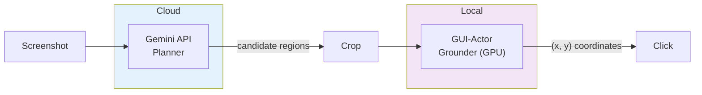
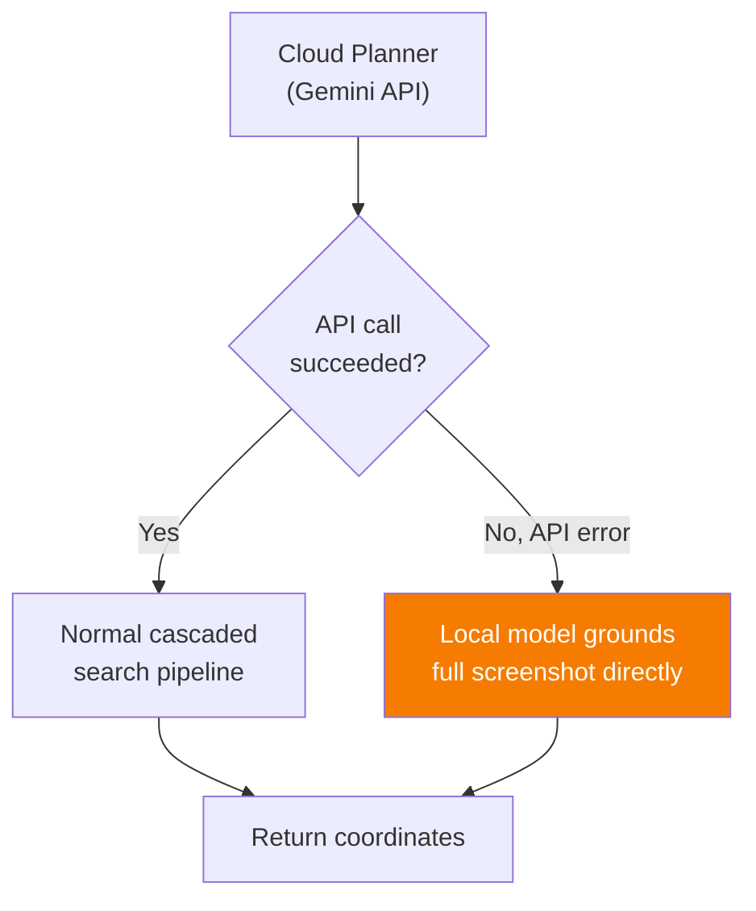
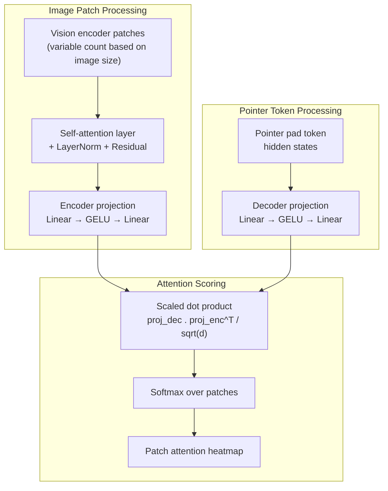
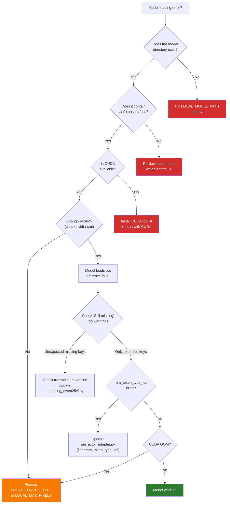

# Local Model Guide

Complete guide for setting up and using the GUI-Actor-3B-Qwen2.5-VL local model for offline GUI element grounding.

---

## Table of Contents

1. [Overview](#overview)
2. [Hardware Requirements](#hardware-requirements)
3. [Installing GPU Dependencies](#installing-gpu-dependencies)
4. [Downloading Model Weights](#downloading-model-weights)
5. [Configuration](#configuration)
6. [Hybrid Mode Setup](#hybrid-mode-setup)
7. [Model Architecture Details](#model-architecture-details)
8. [Transformers Version Compatibility](#transformers-version-compatibility)
9. [Performance Tuning](#performance-tuning)
10. [Troubleshooting](#troubleshooting)

---

## Overview

GUI-Actor-3B is a 3-billion parameter vision-language model based on Qwen2.5-VL, fine-tuned by Microsoft for GUI element grounding. Unlike cloud VLMs that return text-based coordinate predictions, GUI-Actor uses an **attention-based pointer network** that directly attends to image patches — producing more spatially precise results for small UI elements.

**Key advantages:**
- Fully offline — no API calls or internet required for grounding
- Attention-based pointing — more precise than text coordinate prediction
- Fast inference — ~1–3 seconds per grounding call on consumer GPUs
- No per-query cost — unlimited inference after initial setup

**Trade-offs:**
- Requires a CUDA-capable GPU with sufficient VRAM
- Initial model loading takes ~10–15 seconds
- The model checkpoint was trained with transformers v4.x and requires compatibility shims for v5.x

---

## Hardware Requirements

### GPU VRAM Requirements

| Precision | Model Size on Disk | Approximate VRAM Usage | Recommended GPU |
|-----------|-------------------|----------------------|-----------------|
| `float16` | ~7.5 GB | ~7–8 GB | RTX 3060 12 GB, RTX 4060 Ti 16 GB |
| `bfloat16` | ~7.5 GB | ~7–8 GB | RTX 3060 12 GB, RTX 4060 Ti 16 GB |
| `float32` | ~7.5 GB | ~14–16 GB | RTX 3090 24 GB, RTX 4090 24 GB |

> **Note:** VRAM usage increases with input image resolution. The `max_pixels` setting (default: 3200×1800 = 5.76M pixels) controls the maximum image size before downscaling. Reducing this value lowers VRAM usage.

### Minimum System Requirements

| Component | Minimum | Recommended |
|-----------|---------|-------------|
| GPU | NVIDIA with 6 GB VRAM + CUDA support | NVIDIA RTX 3060 12 GB+ |
| CUDA | 11.8+ | 13.2 |
| RAM | 16 GB | 32 GB |
| Disk | 10 GB free (for model weights) | 15 GB free |

### Checking Your GPU

```powershell
# Check if CUDA is available
python -c "import torch; print(f'CUDA available: {torch.cuda.is_available()}'); print(f'GPU: {torch.cuda.get_device_name(0)}'); print(f'VRAM: {torch.cuda.get_device_properties(0).total_mem / 1e9:.1f} GB')"
```

---

## Installing GPU Dependencies

The local model dependencies are in a separate dependency group to keep the base install lightweight.

### Using uv (Recommended)

```powershell
uv sync --group local
```

This installs:
- `torch` (with CUDA 13.2 support, from the PyTorch index)
- `torchvision` (from the PyTorch index)
- `transformers`
- `accelerate`
- `qwen-vl-utils`

### Using pip

```powershell
# Install PyTorch with CUDA support
pip install torch torchvision --index-url https://download.pytorch.org/whl/cu132

# Install transformers and utilities
pip install transformers accelerate qwen-vl-utils
```

### Verifying GPU Setup

```powershell
python -c "import torch; print(f'PyTorch {torch.__version__}'); print(f'CUDA {torch.version.cuda}'); print(f'GPU: {torch.cuda.get_device_name(0)}')"
```

Expected output:
```
PyTorch 2.7.0+cu132
CUDA 13.2
GPU: NVIDIA GeForce RTX 3060
```

---

## Downloading Model Weights

### Option 1: Hugging Face CLI (Recommended)

```powershell
# Install the HF CLI if not already installed
pip install huggingface-hub

# Download into the models/ directory
huggingface-cli download microsoft/GUI-Actor-3B-Qwen2.5-VL --local-dir models/GUI-Actor-3B-Qwen2.5-VL
```

### Option 2: Git LFS

```powershell
# Make sure git-lfs is installed
git lfs install

# Clone into models/
cd models
git clone https://huggingface.co/microsoft/GUI-Actor-3B-Qwen2.5-VL
```

### Option 3: Manual Download

1. Visit [microsoft/GUI-Actor-3B-Qwen2.5-VL](https://huggingface.co/microsoft/GUI-Actor-3B-Qwen2.5-VL) on Hugging Face
2. Download all files
3. Place them in `models/GUI-Actor-3B-Qwen2.5-VL/`

### Verify Download

After downloading, your directory structure should look like:

```
models/
└── GUI-Actor-3B-Qwen2.5-VL/
    ├── config.json
    ├── generation_config.json
    ├── model-00001-of-00002.safetensors    (~5.0 GB)
    ├── model-00002-of-00002.safetensors    (~2.6 GB)
    ├── model.safetensors.index.json
    ├── preprocessor_config.json
    ├── tokenizer.json
    ├── tokenizer_config.json
    ├── special_tokens_map.json
    ├── added_tokens.json
    ├── merges.txt
    ├── vocab.json
    └── ...
```

---

## Configuration

### Basic Local-Only Setup

To use the local model for everything (both planning and grounding):

```ini
# .env
LLM_PROVIDER=local
LOCAL_MODEL_PATH=GUI-Actor-3B-Qwen2.5-VL
LOCAL_MODEL_TYPE=gui-actor
LOCAL_DEVICE=cuda:0
LOCAL_TORCH_DTYPE=float16
LOCAL_ATTN_IMPL=sdpa
```

### Configuration Reference

| Setting | Values | Default | Description |
|---------|--------|---------|-------------|
| `LOCAL_MODEL_PATH` | Relative or absolute path | — | Path to model weights. Relative paths are resolved from `models/` directory |
| `LOCAL_MODEL_TYPE` | `gui-actor` | `gui-actor` | Model family identifier |
| `LOCAL_DEVICE` | `cuda:0`, `cuda:1`, etc. | `cuda:0` | GPU device to load the model on |
| `LOCAL_TORCH_DTYPE` | `float16`, `bfloat16`, `float32` | `float16` | Model precision |
| `LOCAL_ATTN_IMPL` | `sdpa`, `flash_attention_2` | `sdpa` | Attention implementation |
| `LOCAL_MAX_PIXELS` | Integer | `5760000` | Maximum image pixels (width×height) before downscaling |

### Precision Options

| Precision | Speed | VRAM | Stability | Notes |
|-----------|-------|------|-----------|-------|
| `float16` | Fastest | Lowest | Good | Recommended for most GPUs |
| `bfloat16` | Fast | Low | Better | Better numerical stability, requires Ampere+ GPU |
| `float32` | Slowest | Highest | Best | Use only for debugging or if float16 produces NaN |

### Attention Implementations

| Implementation | Speed | Requirements |
|---------------|-------|-------------|
| `sdpa` | Good | PyTorch 2.0+ (built-in) |
| `flash_attention_2` | Faster | Requires `flash-attn` package and Ampere+ GPU |

To use Flash Attention 2:
```powershell
pip install flash-attn --no-build-isolation
```

Then set:
```ini
LOCAL_ATTN_IMPL=flash_attention_2
```

---

## Hybrid Mode Setup

The most powerful configuration uses a **cloud API for planning** (global scene understanding) and the **local model for grounding** (precision localization). This gives the best of both worlds: the cloud model's superior scene understanding and the local model's precise attention-based pointing.

```ini
# .env — Hybrid mode configuration
PLANNER_PROVIDER=gemini
GROUNDER_PROVIDER=local

# Cloud planner settings
GEMINI_API_KEY=your_key_here
PLANNER_MODEL=gemini-2.0-flash

# Local grounder settings
LOCAL_MODEL_PATH=GUI-Actor-3B-Qwen2.5-VL
LOCAL_DEVICE=cuda:0
LOCAL_TORCH_DTYPE=float16
```



### Fallback Behavior

If the cloud Planner fails (API error, rate limit, network outage) and a local grounder is configured, the system automatically falls back to using the local model for direct full-screen grounding — bypassing the cascaded search entirely.



---

## Model Architecture Details

### GUI-Actor-3B-Qwen2.5-VL

| Property | Value |
|----------|-------|
| Base model | Qwen2.5-VL-3B |
| Parameters | ~3 billion |
| Architecture | Vision-Language Model + Pointer Head |
| Hidden size | 2048 |
| Layers | 36 transformer layers |
| Attention heads | 16 (2 key-value heads, GQA) |
| Vision encoder | ViT with 32 blocks, 1280 hidden |
| Patch size | 14×14 pixels |
| Spatial merge | 2×2 (4 patches → 1 token) |
| Vocabulary | 151,670 tokens |
| Special tokens | `<\|pointer_start\|>` (151667), `<\|pointer_end\|>` (151668), `<\|pointer_pad\|>` (151669) |
| Weight tying | `lm_head` tied to `embed_tokens` |

### Pointer Network (VisionHead_MultiPatch)

The pointer head is the key innovation over standard VLMs. Instead of predicting coordinates as text tokens, it computes attention scores between generated pointer tokens and image patch embeddings:



### From Heatmap to Coordinates

1. **Threshold:** Select patches with score > 30% of the maximum
2. **BFS Clustering:** Group connected activated patches into regions
3. **Rank:** Sort regions by average attention score
4. **Weighted Center:** Compute the attention-weighted centroid of the top region
5. **Normalize:** Convert to `(0, 1)` range relative to image dimensions

### Forced Token Generation

The `ForceFollowTokensLogitsProcessor` ensures proper pointer token sequences during generation:

```
<|pointer_start|> → <|pointer_pad|> → <|pointer_end|>
```

Whenever the model generates `<|pointer_start|>`, the next two tokens are forced to be `<|pointer_pad|>` and `<|pointer_end|>`. The hidden state of `<|pointer_pad|>` is used as the query for the pointer attention mechanism.

---

## Transformers Version Compatibility

The GUI-Actor checkpoint was saved with `transformers v4.51.3`. If you are using a newer version (v5.x+), the codebase includes automatic compatibility handling.

### What Changed in transformers v5.x

| Aspect | v4.x | v5.x |
|--------|------|------|
| Model structure | `model.embed_tokens`, `model.layers.*` | `model.language_model.embed_tokens`, `model.language_model.layers.*` |
| Vision encoder | `visual.*` | `model.visual.*` |
| Config attributes | Flat: `config.hidden_size` | Nested: `config.text_config.hidden_size` |
| Processor output | No `mm_token_type_ids` | Includes `mm_token_type_ids` |

### Automatic Compatibility Shims

The codebase handles all of these differences automatically:

| Shim | File | What It Does |
|------|------|-------------|
| Config attribute aliasing | `modeling_qwen25vl.py` `__init__` | Copies `text_config.*` attributes to `config.*` |
| Model structure aliasing | `modeling_qwen25vl.py` `__init__` | Creates `model.embed_tokens` → `model.language_model.embed_tokens` alias |
| Weight key remapping | `modeling_qwen25vl.py` `from_pretrained` | Remaps checkpoint keys: `model.layers.*` → `model.language_model.layers.*` |
| Weight tying | `modeling_qwen25vl.py` `from_pretrained` | Re-ties `lm_head.weight` to `embed_tokens.weight` after loading |
| Processor output filtering | `gui_actor_adapter.py` `ground_element` | Removes `mm_token_type_ids` before calling `generate()` |

### Version Recommendation

| transformers Version | Status |
|---------------------|--------|
| 4.45–4.51 | Native compatibility (no shims needed) |
| 4.52–4.99 | Should work with shims |
| 5.0+ | Supported via automatic shims |

---

## Performance Tuning

### Reducing VRAM Usage

If you're running into out-of-memory (OOM) errors:

**1. Lower `max_pixels`:**
```ini
# Default is 5,760,000 (3200×1800)
# Reduce for lower VRAM usage at the cost of input resolution
LOCAL_MAX_PIXELS=2073600  # 1920×1080
```

**2. Use `float16` precision:**
```ini
LOCAL_TORCH_DTYPE=float16
```

**3. Disable the confirmation step** (reduces grounding calls per element from 2 to 1):
```ini
CONFIRMATION_STEP=false
```

### Reducing Latency

**1. Use Flash Attention 2** (Ampere+ GPUs):
```ini
LOCAL_ATTN_IMPL=flash_attention_2
```

**2. Reduce candidate regions** — set tighter thresholds so fewer crops are grounded:
```ini
CONFIDENCE_THRESHOLD=0.5    # Higher = fewer candidates pass
IoU_THRESHOLD=0.2           # Lower = more aggressive NMS filtering
```

**3. Keep the model loaded** — the model is lazy-loaded on first inference. Subsequent calls reuse the loaded model. First call takes ~10–15s, subsequent calls take ~1–3s.

### Multi-GPU (Future)

Currently, the model loads on a single GPU specified by `LOCAL_DEVICE`. Multi-GPU inference is not yet supported but can be achieved by changing `device_map` in the `from_pretrained` call.

---

## Troubleshooting

### Common Errors

#### `Repo id must use alphanumeric chars...`

**Cause:** The model path resolves to a non-existent directory. HuggingFace falls back to treating it as a Hub repo ID, which fails validation.

**Fix:** Check your `LOCAL_MODEL_PATH` in `.env`:
- If relative (e.g., `GUI-Actor-3B-Qwen2.5-VL`), it's resolved from the `models/` directory
- Do NOT include `models/` in the path — it's prepended automatically
- Verify the directory exists: `dir models\GUI-Actor-3B-Qwen2.5-VL`

---

#### `'Qwen2_5_VLModel' object has no attribute 'embed_tokens'`

**Cause:** transformers v5.x changed the model structure. The `embed_tokens` layer moved under `language_model`.

**Fix:** This is handled automatically by the compatibility shim. If you still see this error, ensure you have the latest version of `modeling_qwen25vl.py`.

---

#### `model_kwargs are not used by the model: ['mm_token_type_ids']`

**Cause:** Newer transformers processors produce `mm_token_type_ids` in their output, but the model's `generate()` method doesn't accept it.

**Fix:** This is handled automatically. The `gui_actor_adapter.py` filters out this key before calling `generate()`.

---

#### `CUDA out of memory`

**Cause:** Insufficient GPU VRAM for the model + input image.

**Fix:**
1. Reduce precision: `LOCAL_TORCH_DTYPE=float16`
2. Reduce image size: Set `LOCAL_MAX_PIXELS` to a smaller value (e.g., `2073600`)
3. Close other GPU-consuming applications
4. Use a GPU with more VRAM

---

#### `Still missing N keys after remap`

**Cause:** Weight remapping from v4→v5 format didn't cover all keys. Expected for `multi_patch_pointer_head.*` (newly initialized) and `lm_head.weight` (tied to embed_tokens).

**When to worry:**
- `multi_patch_pointer_head.*` missing → **Expected.** The pointer head is initialized randomly and was fine-tuned separately.
- `lm_head.weight` missing → **Expected.** It's tied to `embed_tokens.weight` via `tie_word_embeddings=true`.
- Any other keys missing → **Unexpected.** The model may produce incorrect results.

---

#### `This checkpoint seem corrupted. The tied weights mapping...`

**Cause:** During the initial `from_pretrained()` load (before remapping), transformers detects that tied weight keys are missing. This is expected — the correct weights are loaded in the second pass via `load_state_dict()`.

**Fix:** Ignore this warning. Check the log for `"Remapped state dict loaded successfully."` to confirm weights were loaded correctly.

---

#### Model loads but produces garbage coordinates

**Possible causes:**
1. **Weights didn't load correctly.** Check for `"Still missing N keys after remap"` warnings with unexpected key names.
2. **Wrong precision.** Try `bfloat16` instead of `float16`, or vice versa.
3. **Image too small/large.** Ensure the input image is reasonable (not 1×1 pixels, not 10000×10000).

---

### Diagnostic Checklist


