# ScreenSeekeR — Technical Methodology & Architecture

## Table of Contents

1. [Overview](#overview)
2. [High-Level Architecture](#high-level-architecture)
3. [The ScreenSeekeR Grounding Pipeline](#the-screenseeker-grounding-pipeline)
   - [Stage 1 — Screenshot Capture & DPI Handling](#stage-1--screenshot-capture--dpi-handling)
   - [Stage 2 — Planner (Global Region Proposal)](#stage-2--planner-global-region-proposal)
   - [Stage 3 — Scoring & Candidate Ranking](#stage-3--scoring--candidate-ranking)
   - [Stage 4 — Non-Maximum Suppression (NMS)](#stage-4--non-maximum-suppression-nms)
   - [Stage 5 — Grounder (Precision Localization)](#stage-5--grounder-precision-localization)
   - [Stage 6 — Confirmation / Refinement Step](#stage-6--confirmation--refinement-step)
   - [Stage 7 — Coordinate Mapping & Output](#stage-7--coordinate-mapping--output)
4. [Hybrid Mode: Cloud + Local Model](#hybrid-mode-cloud--local-model)
   - [GUI-Actor Local Model Architecture](#gui-actor-local-model-architecture)
   - [Attention-Based Pointer Network](#attention-based-pointer-network)
   - [Weight Remapping (transformers v4 → v5)](#weight-remapping-transformers-v4--v5)
5. [LLM Client — Provider Abstraction Layer](#llm-client--provider-abstraction-layer)
6. [Automation Layer](#automation-layer)
   - [Orchestrator Pipeline](#orchestrator-pipeline)
   - [Notepad Workflow](#notepad-workflow)
   - [Popup Watchdog](#popup-watchdog)
7. [API Integration](#api-integration)
8. [Configuration System](#configuration-system)
9. [Mathematical Foundations](#mathematical-foundations)
10. [File Reference Map](#file-reference-map)

---

## Overview

ScreenSeekeR is a **vision-based desktop automation system** that locates GUI elements using natural language descriptions — without template matching, accessibility APIs, or hard-coded pixel coordinates. It works by:

1. Taking a screenshot of the screen
2. Using a vision language model (VLM) to **plan** where the target element might be
3. **Scoring** and **filtering** candidate regions using Gaussian centrality and NMS
4. Using a VLM to **ground** (precisely locate) the element within cropped regions
5. **Refining** coordinates via a confirmation crop
6. Converting physical pixel coordinates to logical coordinates (accounting for DPI scaling)
7. Performing the click via PyAutoGUI

The system supports **hybrid mode**: using a cloud API (e.g. Gemini) for planning and a local model (GUI-Actor-3B) for grounding, enabling offline-capable precision localization.

---

## High-Level Architecture

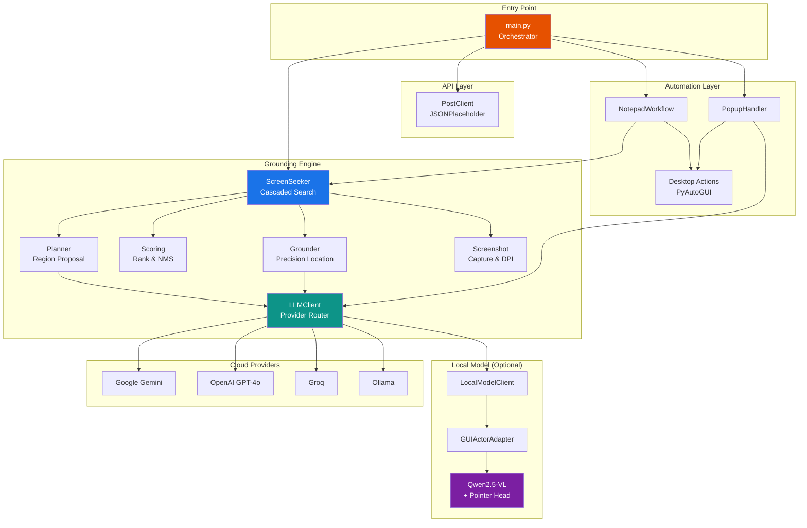

---

## The ScreenSeekeR Grounding Pipeline

The core grounding algorithm follows a **cascaded search** strategy inspired by the ScreenSeekeR paper (arXiv:2504.07981). Instead of asking a model to pinpoint a tiny element on a full-resolution screen in one shot, it breaks the problem into a coarse-to-fine hierarchy.

### End-to-End Pipeline Flow

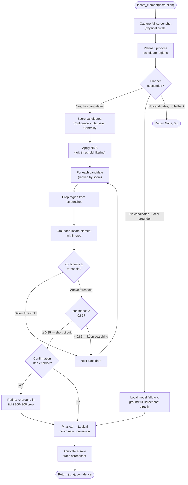

---

### Stage 1 — Screenshot Capture & DPI Handling

**File:** `src/grounding/screenshot.py`

The system captures the primary monitor using `mss`, which returns the screen in **physical pixels**. On a 1920×1080 display at 110% DPI scaling, the physical capture is 2112×1188 pixels.

All internal grounding operations work in physical pixel space. Only at the final output stage are coordinates converted to **logical pixels** for PyAutoGUI:

```
logical_x = physical_x / DPI_SCALING
logical_y = physical_y / DPI_SCALING
```

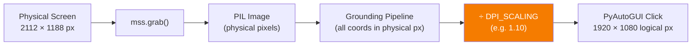

---

### Stage 2 — Planner (Global Region Proposal)

**File:** `src/grounding/planner.py`

The Planner receives the full screenshot and a natural language instruction (e.g., *"the Notepad icon shortcut on the desktop"*). It uses a vision LLM to analyze the entire screen and propose **1–4 candidate bounding boxes** where the target element is likely located.

Each candidate is a normalized bounding box `(x_min, y_min, x_max, y_max)` in the range `[0.0, 1.0]` with a confidence score and description.

**Why not just ask the model to click directly?** Small UI elements (icons, buttons) occupy a tiny fraction of a full-resolution screenshot. Vision models perform significantly better when the target element fills a larger portion of the input image. The Planner's job is to narrow the search area so the Grounder gets a close-up view.

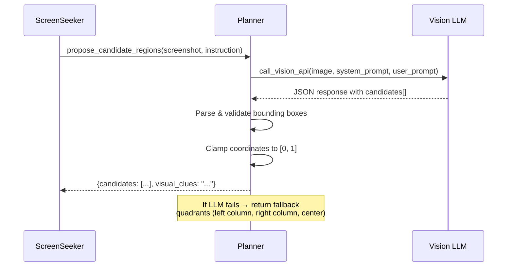

**Fallback Strategy:** If the Planner API call fails entirely (network error, rate limit), it returns three hardcoded search quadrants covering the most common desktop icon locations: left column, right column, and center region.

---

### Stage 3 — Scoring & Candidate Ranking

**File:** `src/grounding/scoring.py`

Each candidate region is scored using a **composite formula** that combines the Planner's confidence with a **Gaussian Centrality** penalty:

$$
\text{Score}(c) = \text{Confidence}(c) \times \exp\!\left(-\frac{d^2}{2\sigma^2}\right)
$$

Where:
- $d$ = Euclidean distance from the candidate's center to the expected reference point (default: screen center `(0.5, 0.5)`)
- $\sigma = 0.3$ (controls how sharply peripheral candidates are penalized)

This biases the search toward screen-center candidates when planner confidence is similar, which is empirically where users most often place targets.

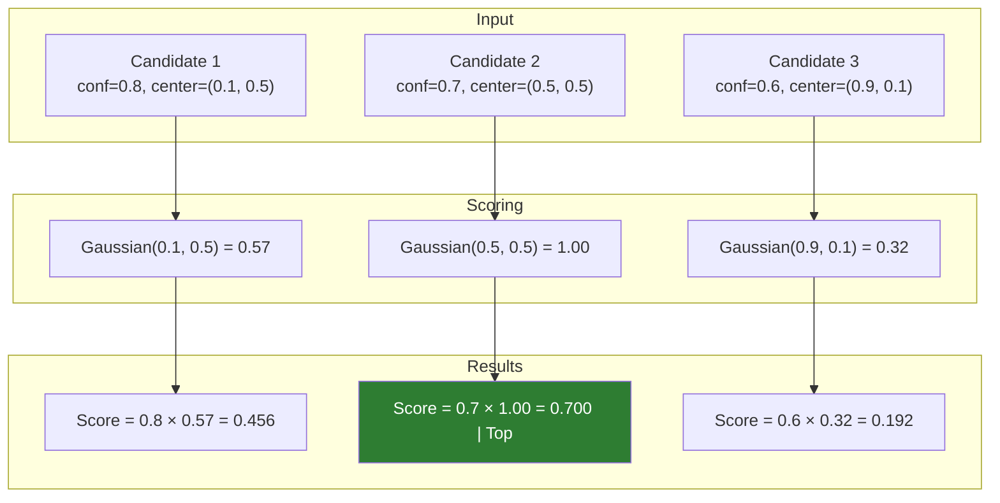

---

### Stage 4 — Non-Maximum Suppression (NMS)

**File:** `src/grounding/scoring.py`

After scoring, candidates are passed through **Non-Maximum Suppression** to eliminate redundant overlapping regions. The algorithm:

1. Sort candidates by score (descending) — already done in Stage 3
2. Pick the top candidate → keep it
3. Remove all remaining candidates whose **IoU** (Intersection over Union) with the kept candidate exceeds the threshold (default: `0.3`)
4. Repeat until no candidates remain

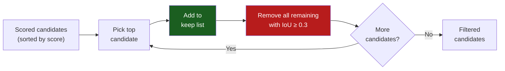

**IoU (Intersection over Union)** measures how much two boxes overlap:

$$
\text{IoU}(A, B) = \frac{|A \cap B|}{|A \cup B|}
$$

---

### Stage 5 — Grounder (Precision Localization)

**File:** `src/grounding/grounder.py`

For each surviving candidate region, the Grounder:

1. **Crops** the corresponding area from the full screenshot
2. Sends the crop + instruction to a vision model
3. Receives a **normalized center point** `(x, y)`, bounding box `(width, height)`, confidence, and reasoning
4. If confidence ≥ threshold (`CONFIDENCE_THRESHOLD`, default `0.4`), the result is considered valid

The first candidate to exceed **0.85 confidence** triggers a **short-circuit** — no further candidates are evaluated.

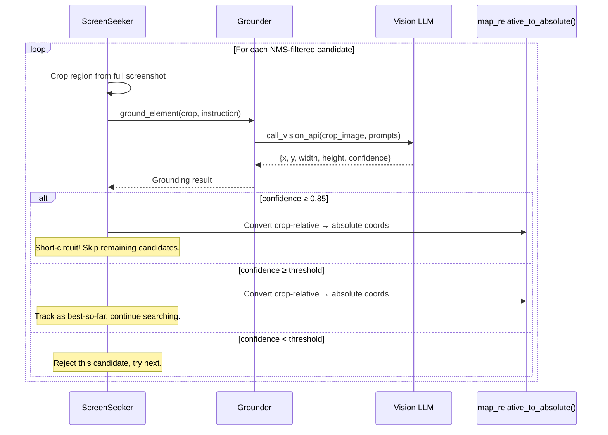

**Coordinate Mapping (`map_relative_to_absolute`):**

The Grounder returns coordinates relative to the crop (0–1). These must be mapped back to full-screenshot physical pixels:

```
abs_x = crop_x_min + (relative_x × crop_width)
abs_y = crop_y_min + (relative_y × crop_height)
```

---

### Stage 6 — Confirmation / Refinement Step

**File:** `src/grounding/screenseeker.py` (lines 186–223)

If `CONFIRMATION_STEP` is enabled (default: `true`), the system performs one final refinement:

1. Crop a tight **200×200 pixel** region centered on the best predicted point
2. Re-run the Grounder on this tiny, high-detail crop
3. If the refinement confidence ≥ 0.30, accept the refined coordinates

This narrows accuracy from "roughly correct region" to "exact click pixel."

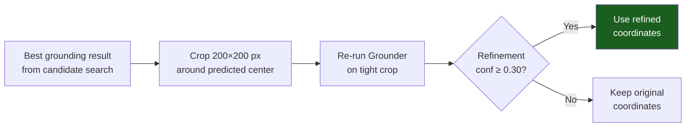

---

### Stage 7 — Coordinate Mapping & Output

The final absolute physical coordinates are converted to logical coordinates for PyAutoGUI, and an annotated screenshot is saved showing:

- 🟡 **Yellow boxes** — all candidate search regions evaluated
- 🟢 **Green box** — the final predicted bounding box
- 🔴 **Red crosshair** — the exact click point
- **Label** — instruction text and confidence percentage

---

## Hybrid Mode: Cloud + Local Model

The system supports running **different providers for Planner and Grounder**. The most powerful configuration is:

| Role | Provider | Model | Purpose |
|------|----------|-------|---------|
| Planner | `gemini` | `gemini-2.0-flash` | Global scene understanding, region proposal |
| Grounder | `local` | `GUI-Actor-3B-Qwen2.5-VL` | Precise element localization |

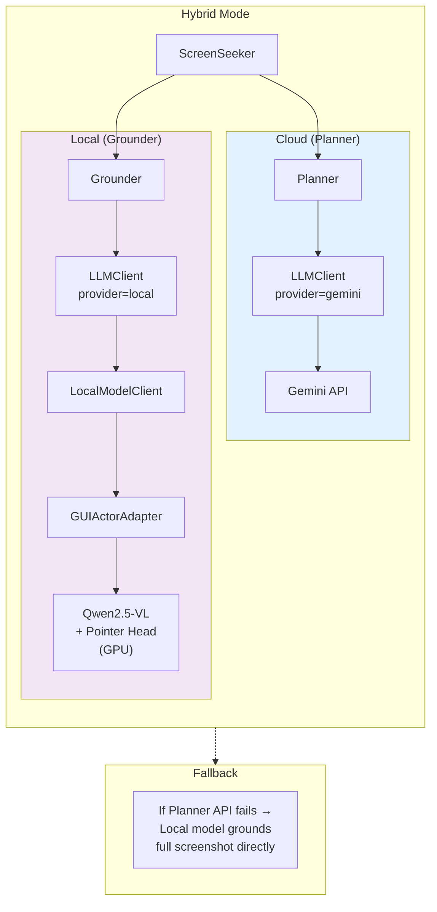

**Fallback behavior:** If the cloud Planner fails (API error, rate limit, network outage) and a local grounder is configured, the system bypasses the cascaded search entirely and uses the local model to ground the element on the full screenshot in a single pass.

---

### GUI-Actor Local Model Architecture

**Files:** `src/grounding/local_model/`

GUI-Actor is a **3B-parameter vision-language model** based on Qwen2.5-VL, fine-tuned by Microsoft for GUI element grounding. Unlike API-based VLMs that return text coordinates, GUI-Actor uses an **attention-based pointer network** that directly attends to visual patches.

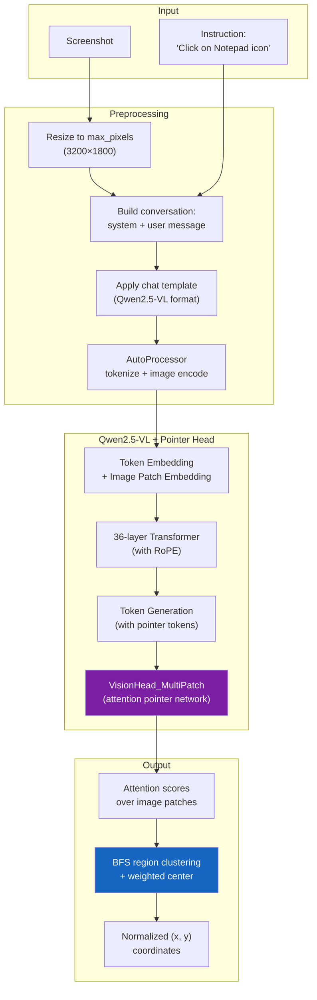

---

### Attention-Based Pointer Network

**File:** `src/grounding/local_model/modeling_qwen25vl.py` — `VisionHead_MultiPatch`

Instead of predicting coordinates as text tokens, GUI-Actor uses a **pointer network** that computes attention scores between:

- **Encoder features** — hidden states of image patch tokens (from the vision encoder)
- **Decoder features** — hidden states of special `<|pointer_pad|>` tokens generated during decoding

The attention score for each image patch represents the model's belief that the target element is located at that patch.

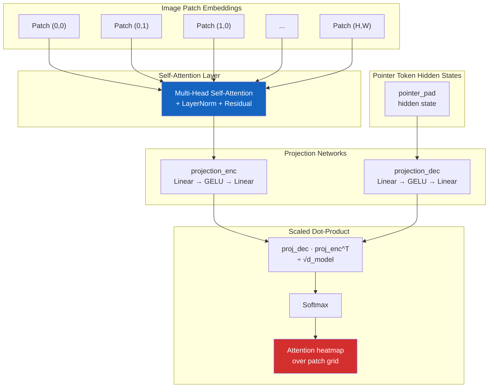

**From Heatmap to Coordinates:**

1. **Threshold** — Select patches with attention score > 30% of the maximum
2. **BFS Clustering** — Group connected activated patches into regions
3. **Rank Regions** — Sort by average attention score
4. **Weighted Center** — Compute the attention-weighted center of the top region
5. **Normalize** — Convert grid coordinates to `(0, 1)` range

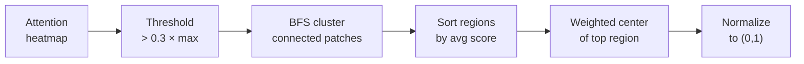

---

### Weight Remapping (transformers v4 → v5)

**File:** `src/grounding/local_model/modeling_qwen25vl.py` — `from_pretrained()`

The GUI-Actor checkpoint was saved with `transformers v4.x`, which used flat key names. When loaded with `transformers v5.x`, the model expects a nested `language_model` prefix:

| Checkpoint Key (v4) | Expected Key (v5) |
|---|---|
| `model.layers.0.self_attn.q_proj.weight` | `model.language_model.layers.0.self_attn.q_proj.weight` |
| `model.embed_tokens.weight` | `model.language_model.embed_tokens.weight` |
| `model.norm.weight` | `model.language_model.norm.weight` |
| `visual.blocks.0.*` | `model.visual.blocks.0.*` |

The custom `from_pretrained()` override:

1. Detects if the checkpoint uses old-format keys (by checking if any key starts with `model.layers.`)
2. Loads all safetensor shards and remaps every key
3. Loads the model architecture with `super().from_pretrained()`
4. Overwrites with the correctly-remapped state dict via `load_state_dict()`
5. Re-ties `lm_head.weight` to `embed_tokens.weight` (since `tie_word_embeddings=true`)

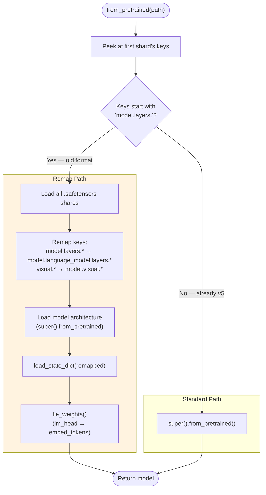

---

## LLM Client — Provider Abstraction Layer

**File:** `src/grounding/llm_client.py`

The `LLMClient` provides a **unified interface** for calling vision models across five providers. Every provider implements the same `call_vision_api(image, system_prompt, user_prompt)` method.

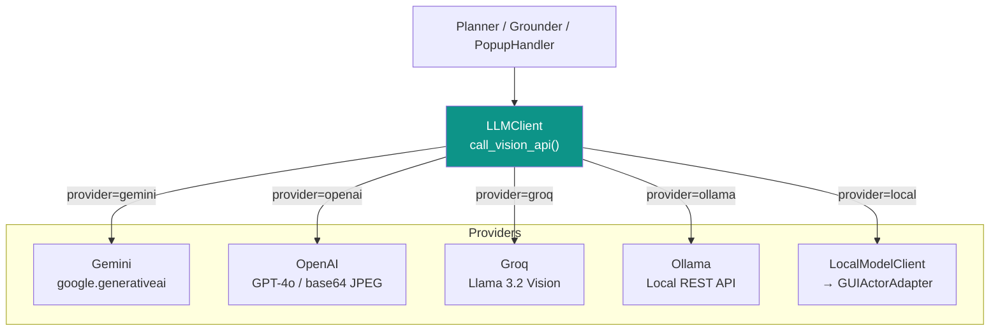

| Provider | Image Format | Auth | JSON Mode |
|----------|-------------|------|-----------|
| Gemini | PIL Image (native) | `GEMINI_API_KEY` | `response_mime_type` |
| OpenAI | Base64 JPEG | `OPENAI_API_KEY` | `response_format` |
| Groq | Base64 JPEG | `GROQ_API_KEY` | Via prompt instruction |
| Ollama | Raw JPEG bytes | Local (no key) | `format="json"` |
| Local | PIL Image (native) | None | N/A (structured output) |

---

## Automation Layer

### Orchestrator Pipeline

**File:** `src/main.py`

The main orchestrator coordinates the full end-to-end workflow:

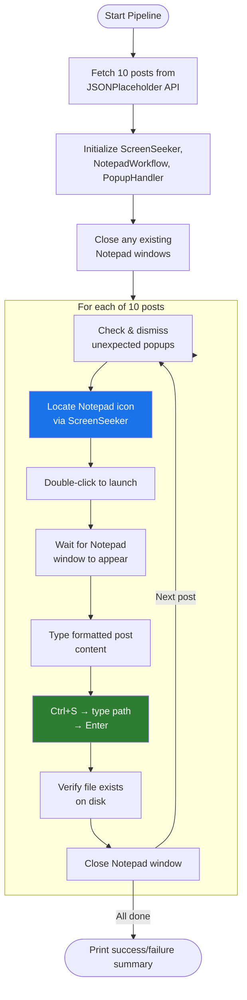

---

### Notepad Workflow

**File:** `src/automation/notepad.py`

The `NotepadWorkflow` class handles Windows 11's modern tabbed Notepad:

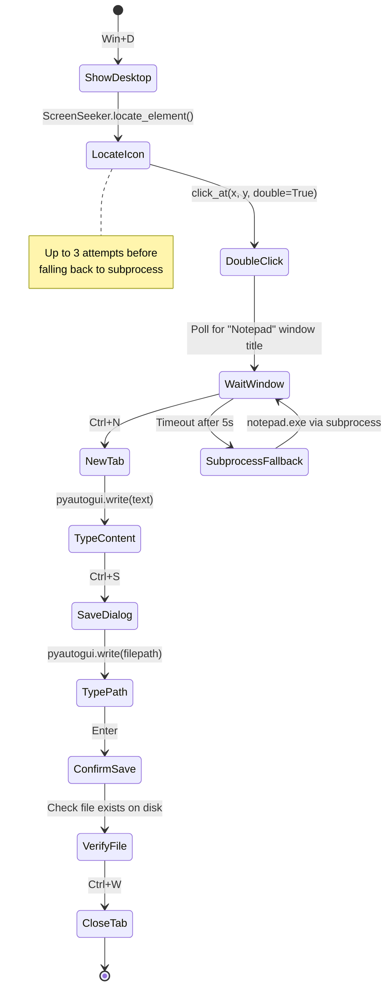

---

### Popup Watchdog

**File:** `src/automation/popups.py`

The `PopupHandler` is a **zero-shot dialog detector** that runs before each automation step. It:

1. Takes a screenshot
2. Asks a vision model: *"Are there any blocking popups or dialogs?"*
3. If detected, locates the dismiss button (Close, Cancel, X, etc.)
4. Clicks it to clear the workspace

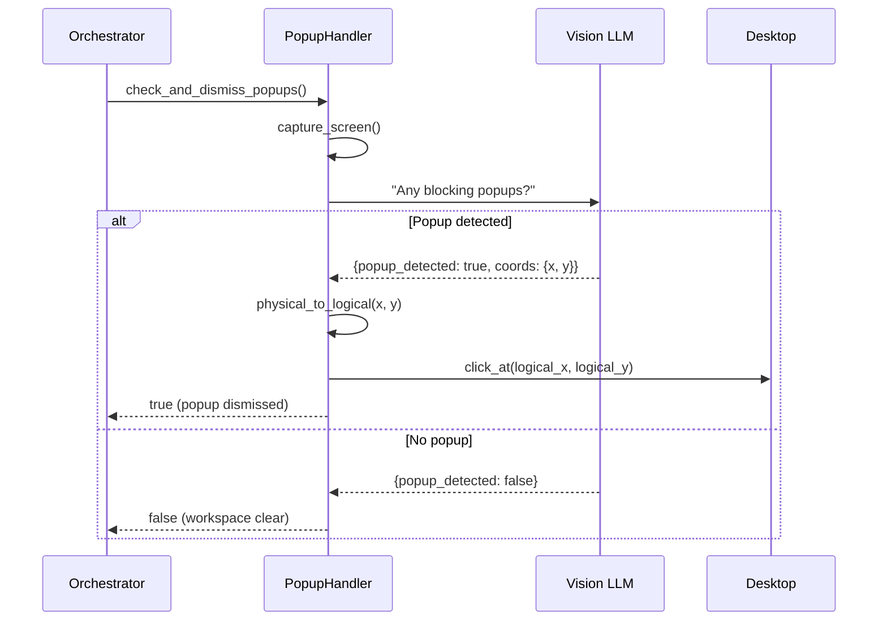

---

## API Integration

**File:** `src/api/posts.py`

The `PostClient` fetches blog posts from the JSONPlaceholder REST API with built-in resilience:

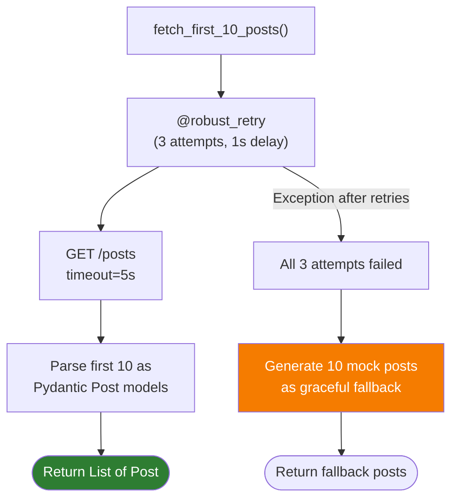

Each `Post` formats its content as:
```
Title: {title}

{body}
```

---

## Configuration System

**File:** `src/config.py`

All settings are managed via a Pydantic `Settings` class that loads from `.env`:

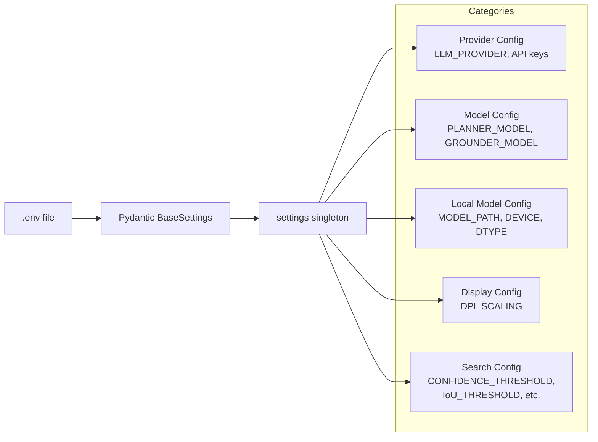

| Setting | Default | Description |
|---------|---------|-------------|
| `LLM_PROVIDER` | `gemini` | Primary vision LLM provider |
| `PLANNER_PROVIDER` | `None` (= `LLM_PROVIDER`) | Override for planner only |
| `GROUNDER_PROVIDER` | `None` (= `LLM_PROVIDER`) | Override for grounder only |
| `DPI_SCALING` | `1.00` | Windows display scale factor |
| `CONFIDENCE_THRESHOLD` | `0.4` | Minimum grounding confidence |
| `IoU_THRESHOLD` | `0.3` | NMS overlap threshold |
| `CONFIRMATION_STEP` | `true` | Enable refinement re-grounding |
| `LOCAL_MODEL_PATH` | `None` | Relative path under `models/` |
| `LOCAL_DEVICE` | `cuda:0` | GPU device for local model |
| `LOCAL_TORCH_DTYPE` | `float16` | Model precision |

---

## Mathematical Foundations

### Gaussian Centrality

Scores candidates by their proximity to an expected reference point:

$$
G(c) = \exp\!\left(-\frac{\|c - r\|^2}{2\sigma^2}\right)
$$

- $c$ = candidate center coordinates
- $r$ = reference point (default screen center)
- $\sigma = 0.3$

### Intersection over Union (IoU)

Measures bounding box overlap for NMS:

$$
\text{IoU}(A, B) = \frac{\text{Area}(A \cap B)}{\text{Area}(A \cup B)} = \frac{\text{Area}(A \cap B)}{\text{Area}(A) + \text{Area}(B) - \text{Area}(A \cap B)}
$$

### Composite Candidate Score

$$
\text{Score}(c) = \text{Confidence}_{\text{planner}}(c) \times G(c)
$$

### DPI Coordinate Mapping

$$
x_{\text{logical}} = \left\lfloor \frac{x_{\text{physical}}}{\text{DPI\_SCALING}} \right\rceil, \quad
y_{\text{logical}} = \left\lfloor \frac{y_{\text{physical}}}{\text{DPI\_SCALING}} \right\rceil
$$

### Crop-Relative to Absolute Mapping

$$
x_{\text{abs}} = x_{\min}^{\text{crop}} + x_{\text{rel}} \cdot w_{\text{crop}}, \quad
y_{\text{abs}} = y_{\min}^{\text{crop}} + y_{\text{rel}} \cdot h_{\text{crop}}
$$

---

## File Reference Map

| File | Module | Purpose |
|------|--------|---------|
| `src/main.py` | Entry | Orchestrates the full automation pipeline |
| `src/config.py` | Config | Pydantic settings from `.env` |
| `src/api/posts.py` | API | JSONPlaceholder client with retry + fallback |
| `src/grounding/screenseeker.py` | **Core** | Cascaded visual search orchestrator |
| `src/grounding/planner.py` | Grounding | Global region proposal via VLM |
| `src/grounding/grounder.py` | Grounding | Precision element localization in crops |
| `src/grounding/scoring.py` | Grounding | Gaussian centrality scoring + NMS |
| `src/grounding/screenshot.py` | Grounding | Screen capture, DPI mapping, annotations |
| `src/grounding/llm_client.py` | Grounding | Multi-provider VLM abstraction |
| `src/grounding/local_model/client.py` | Local | LLMClient-compatible wrapper |
| `src/grounding/local_model/gui_actor_adapter.py` | Local | GUI-Actor inference + coordinate extraction |
| `src/grounding/local_model/modeling_qwen25vl.py` | Local | Custom Qwen2.5-VL with pointer head |
| `src/grounding/local_model/_inference_utils.py` | Local | Forced token generation for pointer sequence |
| `src/automation/desktop.py` | Automation | PyAutoGUI mouse/keyboard primitives |
| `src/automation/notepad.py` | Automation | Windows 11 Notepad workflow driver |
| `src/automation/popups.py` | Automation | Zero-shot popup detection & dismissal |
| `src/utils/retry.py` | Utils | Tenacity-based retry decorator |
| `src/utils/logging.py` | Utils | Loguru logger configuration |
