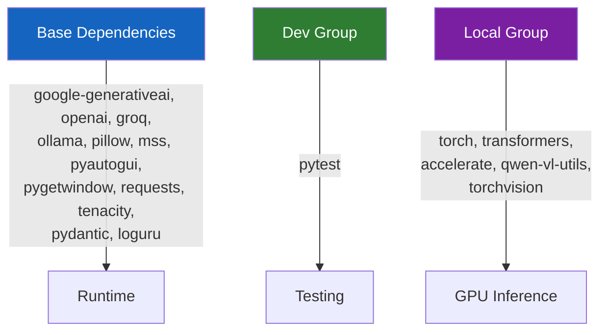

# Setup Guide

Step-by-step instructions for installing and configuring ScreenSeekeR on Windows 11.

---

## Table of Contents

1. [Prerequisites](#prerequisites)
2. [Installation](#installation)
3. [Environment Configuration](#environment-configuration)
4. [Provider Setup](#provider-setup)
5. [Display & DPI Configuration](#display--dpi-configuration)
6. [Verifying the Installation](#verifying-the-installation)
7. [Running the Application](#running-the-application)

---

## Prerequisites

| Requirement | Minimum | Recommended |
|-------------|---------|-------------|
| OS | Windows 10 | Windows 11 |
| Python | 3.11+ | 3.12 |
| Package Manager | pip | [uv](https://github.com/astral-sh/uv) |
| Display | 1920×1080 | 1920×1080 @ 100–125% scaling |
| GPU (local model only) | CUDA-capable, 6 GB VRAM | NVIDIA RTX 3060+ (8 GB VRAM) |

### Software Dependencies

- **Git** — to clone the repository
- **uv** (recommended) — fast Python package manager. Install via:
  ```powershell
  powershell -ExecutionPolicy ByPass -c "irm https://astral.sh/uv/install.ps1 | iex"
  ```
- **CUDA Toolkit 13.2+** — only required if using the local GUI-Actor model
- **Notepad shortcut on Desktop** — the automation expects a visible Notepad icon

---

## Installation

### 1. Clone the Repository

```powershell
git clone https://github.com/ZiadMD/ScreenSeekeR-Desktop-Automation.git
cd ScreenSeekeR-Desktop-Automation
```

### 2. Install Dependencies

**Using uv (recommended):**

```powershell
# Install base dependencies (API-only mode)
uv sync

# Install with local model support (GPU inference)
uv sync --group local
```

**Using pip (alternative):**

```powershell
python -m venv .venv
.venv\Scripts\activate
pip install -e .

# For local model support
pip install torch torchvision --index-url https://download.pytorch.org/whl/cu132
pip install transformers accelerate qwen-vl-utils
```

### Dependency Groups



---

## Environment Configuration

### 1. Create Your `.env` File

```powershell
copy .env.example .env
```

### 2. Configure Your `.env`

Open `.env` in a text editor and configure the settings. Below is a complete reference:

### Provider & API Keys

```ini
# Primary provider — which VLM backend to use
# Options: gemini | openai | groq | ollama | local
LLM_PROVIDER=gemini

# API keys (only the key for your chosen provider is required)
GEMINI_API_KEY=your_gemini_api_key_here
OPENAI_API_KEY=your_openai_api_key_here
GROQ_API_KEY=your_groq_api_key_here
OLLAMA_API_URL=http://localhost:11434
```

### Models

```ini
# Which model to use for planning (global region proposal)
PLANNER_MODEL=gemini-2.0-flash

# Which model to use for grounding (precision localization)
GROUNDER_MODEL=gemini-2.0-flash
```

### Hybrid Mode (Optional)

```ini
# Use different providers for planner and grounder
# Example: Gemini for planning, local GPU model for grounding
PLANNER_PROVIDER=gemini
GROUNDER_PROVIDER=local
```

### Search & Grounding Tuning

```ini
# Enable refinement step (re-ground in tight crop for precision)
CONFIRMATION_STEP=true

# Maximum recursive search depth
MAX_SEARCH_DEPTH=3

# Minimum crop size in pixels
MIN_PATCH_SIZE=256

# NMS overlap threshold (lower = more aggressive filtering)
IoU_THRESHOLD=0.3

# Minimum grounding confidence to accept a result
CONFIDENCE_THRESHOLD=0.4
```

### Local Model (GPU)

```ini
# Path relative to models/ directory (or absolute path)
LOCAL_MODEL_PATH=GUI-Actor-3B-Qwen2.5-VL

# Model type (currently only gui-actor is supported)
LOCAL_MODEL_TYPE=gui-actor

# CUDA device
LOCAL_DEVICE=cuda:0

# Precision — float16 is fastest, bfloat16 more stable, float32 most precise
LOCAL_TORCH_DTYPE=float16

# Attention implementation — sdpa or flash_attention_2
LOCAL_ATTN_IMPL=sdpa
```

### Logging

```ini
# Log level: DEBUG | INFO | WARNING | ERROR
LOG_LEVEL=INFO
```

---

## Provider Setup

### Google Gemini (Default & Recommended)

1. Go to [Google AI Studio](https://aistudio.google.com/apikey)
2. Create an API key
3. Set in `.env`:
   ```ini
   LLM_PROVIDER=gemini
   GEMINI_API_KEY=your_key_here
   PLANNER_MODEL=gemini-2.0-flash
   GROUNDER_MODEL=gemini-2.0-flash
   ```

### OpenAI

1. Go to [OpenAI API Keys](https://platform.openai.com/api-keys)
2. Create an API key
3. Set in `.env`:
   ```ini
   LLM_PROVIDER=openai
   OPENAI_API_KEY=sk-your_key_here
   PLANNER_MODEL=gpt-4o
   GROUNDER_MODEL=gpt-4o
   ```

### Groq

1. Go to [Groq Console](https://console.groq.com/keys)
2. Create an API key
3. Set in `.env`:
   ```ini
   LLM_PROVIDER=groq
   GROQ_API_KEY=gsk_your_key_here
   PLANNER_MODEL=llama-3.2-90b-vision-preview
   GROUNDER_MODEL=llama-3.2-11b-vision-preview
   ```

### Ollama (Local API)

1. Install [Ollama](https://ollama.com/)
2. Pull a vision model:
   ```powershell
   ollama pull llama3.2-vision
   ```
3. Set in `.env`:
   ```ini
   LLM_PROVIDER=ollama
   OLLAMA_API_URL=http://localhost:11434
   PLANNER_MODEL=llama3.2-vision
   GROUNDER_MODEL=llama3.2-vision
   ```

### Local GPU Model (GUI-Actor)

See the dedicated [Local Model Guide](local_model_guide.md).

### Provider Comparison

| Provider | Latency | Cost | Accuracy | Offline |
|----------|---------|------|----------|---------|
| Gemini `gemini-2.0-flash` | ~1–2s | Free tier available | Best (ScreenSpot-Pro leaderboard) | No |
| OpenAI `gpt-4o` | ~2–3s | $2.50/1M input tokens | Very good | No |
| Groq `llama-3.2-90b-vision` | ~0.5–1s | Free tier available | Good | No |
| Ollama `llama3.2-vision` | ~3–10s | Free (local) | Moderate | Yes |
| Local `GUI-Actor-3B` | ~1–3s | Free (GPU required) | Good (attention-based) | Yes |

---

## Display & DPI Configuration

ScreenSeekeR captures the screen in **physical pixels** but automates via PyAutoGUI in **logical pixels**. The `DPI_SCALING` factor bridges this gap.

### How to Find Your DPI Scaling

1. Right-click Desktop → **Display settings**
2. Look for **Scale and layout** → **Scale**
3. The percentage maps to the scaling factor:

| Windows Setting | `DPI_SCALING` Value |
|-----------------|---------------------|
| 100% | `1.00` |
| 110% | `1.10` |
| 125% | `1.25` |
| 150% | `1.50` |

Set in `.env`:
```ini
DPI_SCALING=1.10
```

### Verifying DPI Settings

If clicks are consistently offset from their intended targets, your DPI scaling is likely misconfigured. Signs:

- **Clicks land too far right/down** → `DPI_SCALING` is set too low
- **Clicks land too far left/up** → `DPI_SCALING` is set too high

---

## Verifying the Installation

### Run Tests

```powershell
uv run pytest tests/ -v
```

Expected output:

```
tests/test_api.py::test_post_model_creation PASSED
tests/test_api.py::test_post_formatting PASSED
tests/test_grounding.py::test_map_relative_to_absolute PASSED
tests/test_scoring.py::test_gaussian_centrality PASSED
tests/test_scoring.py::test_iou PASSED
tests/test_scoring.py::test_nms PASSED
```

### Verify Provider Connection

Quick sanity check that your API key works:

```python
from src.grounding.llm_client import LLMClient
from PIL import Image

client = LLMClient()
# Create a small test image
img = Image.new("RGB", (100, 100), "white")
response = client.call_vision_api(img, "Describe this image.", "What do you see?")
print(response)
```

---

## Running the Application

### Prerequisites Before Launch

1. **Notepad shortcut must be visible on the desktop**
2. **Desktop must not be fully covered by other windows** (the system sends Win+D first, but verify)
3. **Mouse failsafe is active** — move the mouse to any screen corner to abort execution

### Execute

```powershell
uv run src/main.py
```

### What Happens

1. Fetches 10 posts from JSONPlaceholder API
2. For each post:
   - Checks for blocking popups (dismisses if found)
   - Locates the Notepad icon via vision grounding
   - Double-clicks to launch Notepad
   - Types the formatted post content
   - Saves as `post_{id}.txt` on the Desktop
   - Closes Notepad
3. Prints a summary of successes and failures

### Output

Saved files appear at: `C:\Users\{username}\Desktop\post_1.txt` through `post_10.txt`

Annotated detection screenshots are saved in the `screenshots/` directory.

Logs are written to `logs/automation.log` (rotated at 10 MB, retained 5 days).
